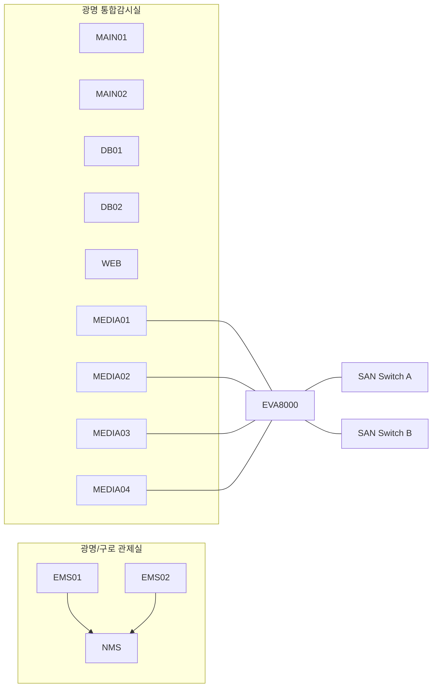

# 토폴로지(개념도)

```mermaid
flowchart LR
  subgraph ControlRooms[광명/구로 관제실]
    EMS1[EMS01] --> NMS[NMS]
    EMS2[EMS02] --> NMS
  end

  subgraph DC[광명 통합감시실]
    MAIN1[MAIN01]
    MAIN2[MAIN02]
    DB1[DB01]
    DB2[DB02]
    WEB[WEB]
    NMS
    MEDIA1[MEDIA01]:::eva
    MEDIA2[MEDIA02]:::eva
    MEDIA3[MEDIA03]:::eva
    MEDIA4[MEDIA04]:::eva
  end

  classDef eva fill:#eef,stroke:#99f;

  MEDIA1 --- EVA[EVA8000]
  MEDIA2 --- EVA
  MEDIA3 --- EVA
  MEDIA4 --- EVA

  EVA --- SAN_A[SAN Switch A]
  EVA --- SAN_B[SAN Switch B]
```